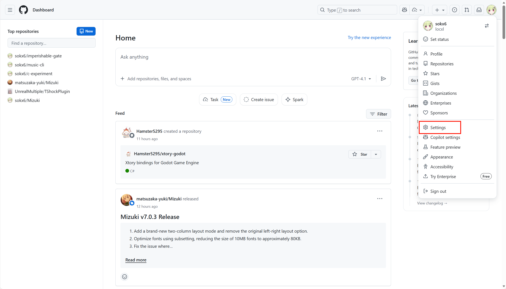
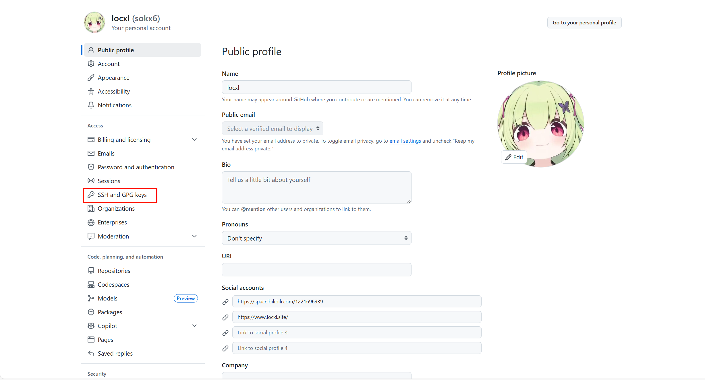

# 生成 ssh 密钥

1. 创建 ssh 密钥存放目录并进入

   ```bash
   # 创建目录
   mkdir ~/.ssh

   # 进入目录
   cd ~/.ssh
   ```

2. 生成 ssh 密钥

   ```bash
   # 将邮箱替换为你的邮箱
   ssh-keygen -t rsa  -C "your_email@example.com"
   ```

3. 查看 ssh 公钥

   ```bash
   cat id_rsa.pub
   # 将全部输出复制
   ```

# 将公钥添加到 github

1. 登录  [GitHub](https://github.com/)。
2. 点击右上角的头像 → **Settings**（设置）。
   
3. 在左侧菜单选择  **SSH and GPG keys**。
   
4. 点击  **New SSH key** 。
   
5. 在  **Title**  中填写一个名称（例如：`My Laptop`）。
6. 在  **Key**  中粘贴你之前复制的公钥内容。
   
7. 点击  **Add SSH key**。

# 测试 ssh 连接

运行以下命令测试是否成功连接：

```bash
ssh -T git@github.com
# 第一次可能要输入yes来添加github主机密钥
```

如果看到类似下面的信息，说明配置成功：

```text
Hi username! You've successfully authenticated, but GitHub does not provide shell access.
```

# 完成

现在可以使用 SSH 地址克隆仓库了：

```bash
git clone git@github.com:username/repository.git
```

如果你的远程仓库之前是 https 连接的，那可以运行如下命令改为 ssh 连接

1. 查看仓库地址
   ```bash
   git remote -v
   ```
   应该有类似如下输出
   ```text
   origin  https://github.com/username/repo.git(fetch)
   origin  https://github.com/username/repo.git(push)
   ```
2. 修改远程仓库的 URL 为 SSH 格式
   ```bash
   # username和repo根据之前输出的仓库地址自行更改
   git remote set-url origin git@github.com:username/repo.git
   ```
3. 验证远程仓库地址
   运行以下命令查看当前远程仓库的 URL：
   ```bash
   git remote -v
   ```
   输出应类似于：
   ```text
   origin	git@github.com:yourname/yourrepo.git (fetch)
   origin	git@github.com:yourname/yourrepo.git (push)
   ```
>如果你的远程仓库名称不是 `origin`，请替换为对应的名称。例如：
>`git remote set-url <remote-name> git@github.com:username/repo.git`
# 有什么用？
1. 更加安全
2. 更加方便，避免HTTPS频繁验证问题
3. 似乎还能解决一些访问github时遇到的网络问题
   >之前在服务器上https连接不能推送，但是换成ssh连接就能推送了