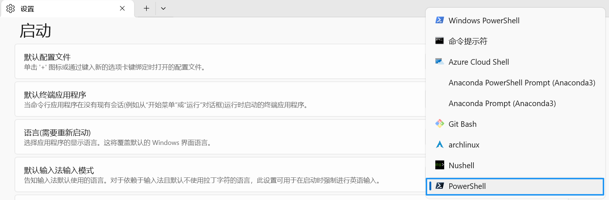
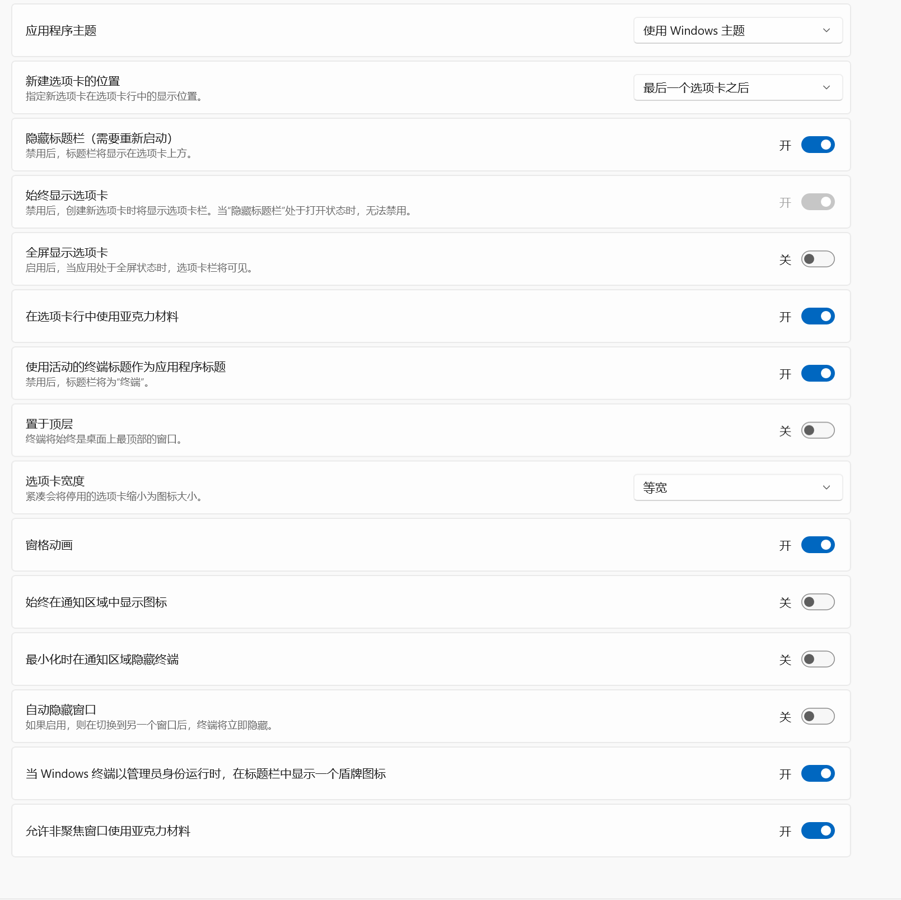

# 安装powershell最新版
由于我使用的是最新版（因为用旧版遇到了各种各样的问题），所以我选择先安装powershell的最新版
输入以下指令
```bash
# 使用winget安装powershell，当然你也可以用scoop，但是我忘记怎么安装scoop了
winget install --id Microsoft.PowerShell --source winget

# 验证安装成功
pwsh --version
# 这里应该出现类似PowerShell 7.5.4的输出

# 查找安装目录（可选）
where.exe pwsh
# 不能直接where我实在是不理解

# 或者你也可以这样
Get-Command pwsh
# powershell的指令是真长
```
现在你应该安装好了最新版的powershell，让我们进入下一步
# 安装字体
为了之后的主题能正常显示，我们这里先安装字体
1. 首先，在字体网站下载字体
2. 右键
3. 然后安装
注意，需要有管理员权限

## 推荐的字体
1. [Fira Code Nerd Font](https://github.com/ryanoasis/nerd-fonts/)
2. [JetBrains Mono](https://www.jetbrains.com/zh-cn/lp/mono/)

# 配置windows terminal
## 修改默认配置文件
1. 首先右键点击windows标签栏空白处
2. 点击设置
3. 更改默认配置文件为我门刚刚安装的powershell
   

## 具体配置 
得益于windows terminal的图形化界面，我们不用直接更改配置文件，只需要在图形化的界面中操作就行了
1. 点击外观，在这里你可以随意修改，这是我的配置，仅供参考
   
2. 点击我们之前安装的powershell的配置文件，在这里你可以选择图标和其他的一些配置
3. 点击外观，修改字体为FiraCode Nerd Font，当然你也可以使用JetBrains Mono，其余如光标形状等也可以自行修改，这是参考配置:
   - 配色方案: Cambell
   - 字体: FiraCode Nerd Font
   - 全色表情符号: true
   - 光标形状: 实心框
   - 背景图像: 自行选择
   - 背景图像拉伸模式: 均匀填充(其他模式我感觉有点奇怪)
   - 背景图像对齐: 居中
   - 背景图像不透明度: 40%
   - 背景不透明度: 随意，如果有背景图像的话，这个不起什么作用
   - 启用亚克力材料: 同上
   >如果启用了背景图像，建议不透明度调低一点，不然字可能有点难看清

以下是最终的配置文件
```json
{
    "$help": "https://aka.ms/terminal-documentation",
    "$schema": "https://aka.ms/terminal-profiles-schema",
    "actions": [],
    "compatibility.enableUnfocusedAcrylic": true,
    "copyFormatting": "none",
    "copyOnSelect": false,
    "defaultProfile": "{574e775e-4f2a-5b96-ac1e-a2962a402336}",
    "keybindings": 
    [
        {
            "id": "Terminal.CopyToClipboard",
            "keys": "ctrl+c"
        },
        {
            "id": "Terminal.FindText",
            "keys": "ctrl+shift+f"
        },
        {
            "id": "Terminal.PasteFromClipboard",
            "keys": "ctrl+v"
        },
        {
            "id": "Terminal.DuplicatePaneAuto",
            "keys": "alt+shift+d"
        }
    ],
    "newTabMenu": 
    [
        {
            "type": "remainingProfiles"
        }
    ],
    "profiles": 
    {
        "defaults": 
        {
            "bellStyle": "none",
            "font": 
            {
                "face": "FiraCode Nerd Font"
            },
            "opacity": 70,
            "useAcrylic": true
        },
        "list": 
        [
            {
                "backgroundImage": "C:\\Users\\locxl\\Pictures\\Anime\\Miku\\Miku1.jpg",
                "backgroundImageOpacity": 0.7,
                "commandline": "%SystemRoot%\\System32\\WindowsPowerShell\\v1.0\\powershell.exe",
                "cursorShape": "filledBox",
                "guid": "{61c54bbd-c2c6-5271-96e7-009a87ff44bf}",
                "hidden": false,
                "name": "Windows PowerShell"
            },
            {
                "commandline": "%SystemRoot%\\System32\\cmd.exe",
                "guid": "{0caa0dad-35be-5f56-a8ff-afceeeaa6101}",
                "hidden": false,
                "name": "\u547d\u4ee4\u63d0\u793a\u7b26"
            },
            {
                "guid": "{b453ae62-4e3d-5e58-b989-0a998ec441b8}",
                "hidden": false,
                "name": "Azure Cloud Shell",
                "source": "Windows.Terminal.Azure"
            },
            {
                "commandline": "%WINDIR%\\System32\\WindowsPowerShell\\v1.0\\powershell.exe -ExecutionPolicy ByPass -NoExit -Command \"& 'D:\\Anaconda3\\shell\\condabin\\conda-hook.ps1' ; conda activate 'D:\\Anaconda3' \"",
                "guid": "{34bcaf21-d6db-54f7-b2b0-a104954acc6c}",
                "icon": "D:\\Anaconda3\\Menu\\anaconda_powershell_prompt.ico",
                "name": "Anaconda PowerShell Prompt (Anaconda3)",
                "startingDirectory": "C:\\Users\\locxl"
            },
            {
                "commandline": "%WINDIR%\\System32\\cmd.exe \"/K\" D:\\Anaconda3\\Scripts\\activate.bat D:\\Anaconda3",
                "guid": "{0b39dd2d-edd5-5d9c-995b-65b96641cf51}",
                "icon": "D:\\Anaconda3\\Menu\\anaconda_prompt.ico",
                "name": "Anaconda Prompt (Anaconda3)",
                "startingDirectory": "C:\\Users\\locxl"
            },
            {
                "guid": "{2ece5bfe-50ed-5f3a-ab87-5cd4baafed2b}",
                "hidden": false,
                "name": "Git Bash",
                "source": "Git"
            },
            {
                "guid": "{348ec03f-dbb3-5a82-8e72-ea4c3d741dc0}",
                "hidden": false,
                "name": "Developer Command Prompt for VS 2019",
                "source": "Windows.Terminal.VisualStudio"
            },
            {
                "guid": "{b15c1a6d-e614-5cb3-beef-6a574b608967}",
                "hidden": false,
                "name": "Developer PowerShell for VS 2019",
                "source": "Windows.Terminal.VisualStudio"
            },
            {
                "guid": "{3bccee2c-0276-595b-9747-037cfd87c3ff}",
                "hidden": false,
                "name": "archlinux",
                "source": "Microsoft.WSL"
            },
            {
                "guid": "{8dbe0ecb-d5e8-52f6-847e-06e577a8112c}",
                "hidden": false,
                "name": "archlinux",
                "source": "Microsoft.WSL"
            },
            {
                "guid": "{47302f9c-1ac4-566c-aa3e-8cf29889d6ab}",
                "hidden": false,
                "name": "Nushell",
                "source": "nu"
            },
            {
                "backgroundImage": "C:\\Users\\locxl\\Pictures\\Anime\\Default\\Shiina Mashiro.png",
                "backgroundImageOpacity": 0.4,
                "cursorShape": "filledBox",
                "guid": "{574e775e-4f2a-5b96-ac1e-a2962a402336}",
                "hidden": false,
                "name": "PowerShell",
                "opacity": 100,
                "source": "Windows.Terminal.PowershellCore",
                "useAcrylic": false
            }
        ]
    },
    "schemes": [],
    "showTabsFullscreen": false,
    "theme": "system",
    "themes": [],
    "useAcrylicInTabRow": true
}
```
>这里的`"bellStyle": "none"`是为了禁用蜂鸣器，不然tab补全可能会哔的一声，很烦

# 安装oh-my-posh

## 概述
[**Oh-My-Posh**](https://ohmyposh.dev/) 是一个用于 **PowerShell** 和 **Windows Terminal** 的命令行提示符（prompt）自定义工具，它允许你为命令行界面（CLI）创建美观、功能丰富的提示符。它的名字来源于类似 **Oh-My-Zsh**（Zsh 的美化工具），但 Oh-My-Posh 专为 PowerShell 和 Windows 环境设计。
下面是它是[github链接](https://github.com/JanDeDobbeleer/oh-my-posh)

## 安装

> 如果提示“无法加载来自位置的脚本”，请运行：
> ```shell
> Set-ExecutionPolicy RemoteSigned -Scope CurrentUser
> ```

## 配置
输入指令：
```shell
# 建议先安装vscode，否则下面无法运行
code $PROFILE
```
然后编辑文件：
```shell
Import-Module posh-git

Import-Module PSReadLine

# 显示历史命令
Set-PSReadLineOption -PredictionSource History

# 以列表形式显示
Set-PSReadLineOption -PredictionViewStyle ListView

# 这里可以设置主题
oh-my-posh init pwsh --config "$env:POSH_THEMES_PATH\catppuccin.omp.json" | Invoke-Expression

Import-Module DirColors
```
这个[网站](https://ohmyposh.dev/docs/themes)能看到oh-my-posh的各种主题。

## 常见?问题
### python虚拟环境显示问题
有的主题不支持显示python的虚拟环境，例如我当前使用的主题`catppuccin`
它原来的配置文件是这样的:
```json
{
  "$schema": "https://raw.githubusercontent.com/JanDeDobbeleer/oh-my-posh/main/themes/schema.json",
  "palette": {
        "os": "#ACB0BE",
        "pink": "#F5BDE6",
        "lavender": "#B7BDF8",
        "blue":  "#8AADF4",
        "wight": "#FFFFFF",
        "text": "#494D64"
  },
  "blocks": [
    {
      "alignment": "left",
      "segments": [
        {
          "background": "p:blue",
          "foreground": "p:wight",
          "powerline_symbol": "\ue0b4",
          "leading_diamond": "\ue0b6",
          "style": "diamond",
          "template": "{{.Icon}} ",
          "type": "os"
        },
        {
          "background": "p:blue",
          "foreground": "p:text",
          "powerline_symbol": "\ue0b4",
          "style": "diamond",
          "template": "{{ .UserName }}@{{ .HostName }}",
          "type": "session"
        },
        {
          "background": "p:pink",
          "foreground": "p:text",
          "properties": {
            "folder_icon": "..\ue5fe..",
            "home_icon": "~",
            "style": "agnoster_short"
          },
          "powerline_symbol": "\ue0b4",
          "style": "powerline",
          "template": " {{ .Path }}",
          "type": "path"
        },
        {
          "background": "p:lavender",
          "foreground": "p:text",
          "style": "powerline",
          "properties": {
            "branch_icon": "\ue725 ",
            "cherry_pick_icon": "\ue29b ",
            "commit_icon": "\uf417 ",
            "fetch_status": false,
            "fetch_upstream_icon": false,
            "merge_icon": "\ue727 ",
            "no_commits_icon": "\uf0c3 ",
            "rebase_icon": "\ue728 ",
            "revert_icon": "\uf0e2 ",
            "tag_icon": "\uf412 "
          },
          "powerline_symbol": "\ue0b4",
          "template": " {{ .HEAD }}",
          "type": "git"
        }
      ],
      "type": "prompt"
    }
  ],
  "final_space": true,
  "version": 3
}
```
里面的segment没有一个的type是python，也就是说，它不支持显示python的虚拟环境显示
但是我们可以手动向里面添加segment使得它支持python环境显示，我添加在path之前，这决定了虚拟环境显示名称的位置：
```json
        {
          "background": "p:miku",
          "foreground": "p:wight",
          "type": "python",
          "style": "powerline",
          "properties": {
          "display_mode": "environment",
          "fetch_virtual_env": true,
          "home_enabled": true,
          "folder_name_fallback": false
          },
          "template": "  {{ .Venv }}"
        },
```
这里的背景色(foreground)是我自定义的miku
在`palette` 里添加`"miku":"#39C5BB"`即可(你也可以添加任意的名称-颜色十六进制代码组合)
于是，修改后的代码就是这样的:
```json
{
  "$schema": "https://raw.githubusercontent.com/JanDeDobbeleer/oh-my-posh/main/themes/schema.json",
  "palette": {
        "miku":"#39C5BB",
        "os": "#ACB0BE",
        "pink": "#F5BDE6",
        "lavender": "#B7BDF8",
        "blue":  "#8AADF4",
        "wight": "#FFFFFF",
        "text": "#494D64"
  },
  "blocks": [
    {
      "alignment": "left",
      "segments": [
        {
          "background": "p:blue",
          "foreground": "p:wight",
          "powerline_symbol": "\ue0b4",
          "leading_diamond": "\ue0b6",
          "style": "diamond",
          "template": "{{.Icon}} ",
          "type": "os"
        },
        {
          "background": "p:blue",
          "foreground": "p:text",
          "powerline_symbol": "\ue0b4",
          "style": "diamond",
          "template": "{{ .UserName }}@{{ .HostName }}",
          "type": "session"
        },
        {
          "background": "p:miku",
          "foreground": "p:wight",
          "type": "python",
          "style": "powerline",
          "properties": {
          "display_mode": "environment",
          "fetch_virtual_env": true,
          "home_enabled": true,
          "folder_name_fallback": false
          },
          "template": "  {{ .Venv }}"
        },
        {
          "background": "p:pink",
          "foreground": "p:text",
          "properties": {
            "folder_icon": "..\ue5fe..",
            "home_icon": "~",
            "style": "agnoster_short"
          },
          "powerline_symbol": "\ue0b4",
          "style": "powerline",
          "template": " {{ .Path }}",
          "type": "path"
        },
        {
          "background": "p:lavender",
          "foreground": "p:text",
          "style": "powerline",
          "properties": {
            "branch_icon": "\ue725 ",
            "cherry_pick_icon": "\ue29b ",
            "commit_icon": "\uf417 ",
            "fetch_status": false,
            "fetch_upstream_icon": false,
            "merge_icon": "\ue727 ",
            "no_commits_icon": "\uf0c3 ",
            "rebase_icon": "\ue728 ",
            "revert_icon": "\uf0e2 ",
            "tag_icon": "\uf412 "
          },
          "powerline_symbol": "\ue0b4",
          "template": " {{ .HEAD }}",
          "type": "git"
        }
      ],
      "type": "prompt"
    }
  ],
  "final_space": true,
  "version": 3
}

```

这是修改前的样子（没有虚拟环境显示）：

这是修改后的样子（有虚拟环境显示）：

